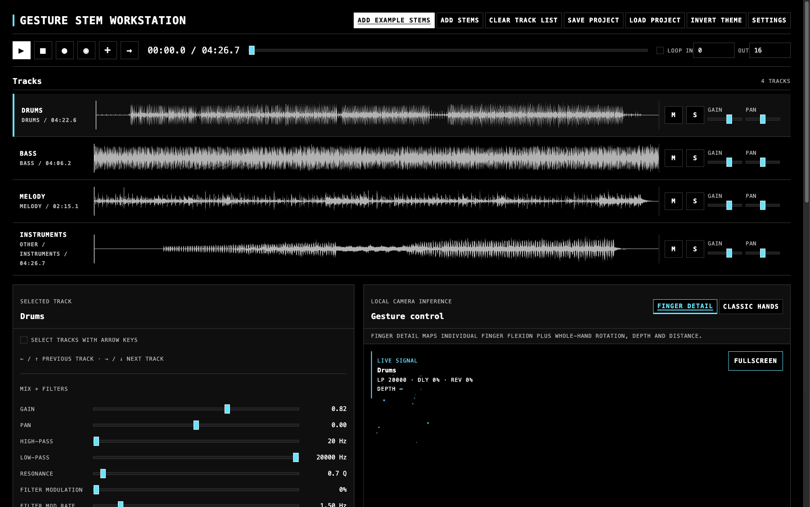
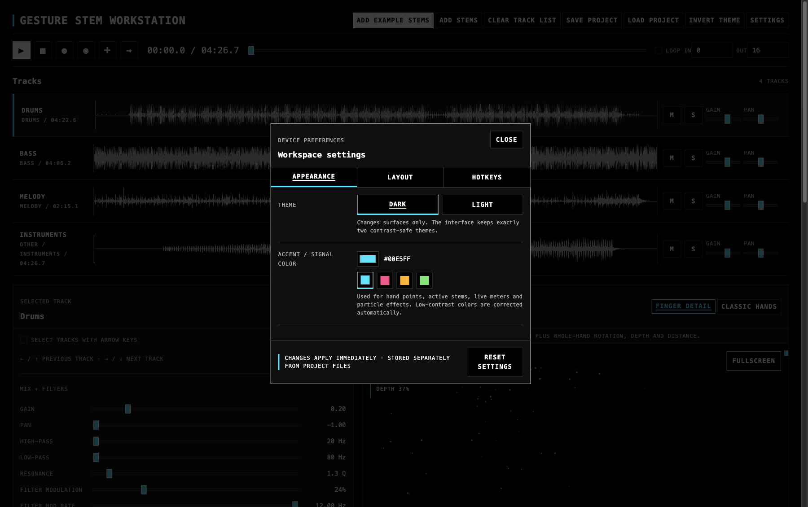

# Gesture Stem Workstation

**Gesture Stem Workstation** is a local-first, browser-based performance instrument for turning separated music stems into an expressive, gesture-controlled live set. Load stems, keep them in sync on one transport, shape each track with real-time effects, and use hand movement—processed entirely on your device—to control the selected sound.

It is deliberately not a cloud DAW, a webcam demo, or a thin wrapper around another project. It is a new, modular workstation designed to connect stem separation, audio analysis, Web Audio, and computer-vision gestures without making any one dependency the centre of the application.



> The screenshot uses the four bundled example stems. No camera footage or audio leaves the computer.

## What you can do today

- Import pre-separated WAV, MP3, FLAC, or M4A files, or add the four bundled example stems.
- Keep tracks of different lengths synchronized through a single transport with play, pause, stop, seek, and loop controls.
- Select, mute, solo, and mix tracks; adjust gain, pan, high-pass, low-pass, resonance, delay, feedback, and convolution reverb in real time.
- Control a selected track with local MediaPipe hand tracking or with a deterministic synthetic gesture source for testing and accessibility.
- Use the detailed **Finger detail** profile or the simpler **Classic hands** profile; both include smoothing and stable mapping behaviour.
- Trigger and modulate non-destructive experimental effects: saturation, bit reduction, tremolo, feedback freeze, stutter, and reverse playback.
- Record a local stereo performance as WebM/Opus and independently record/replay gesture automation.
- Save and reload versioned project state as JSON, while keeping source audio immutable.
- Capture and recall scenes, learn gesture mappings, transcribe suitable melodic tracks locally with Basic Pitch, export MIDI, and morph between source audio and browser resynthesis.
- Optionally send mapped controls as MIDI CC to an external instrument or DAW through Web MIDI.

## Current scope

The playable vertical slice is stable: stem import, synchronized playback, track controls, local gesture mapping, project persistence, recording, and the local processor are implemented. The following capabilities are intentionally marked experimental or incomplete:

| Area | Status |
| --- | --- |
| Stem separation | Available through an optional local `python-audio-separator` adapter. |
| Audio-to-MIDI and resynthesis | Available locally through Basic Pitch and a browser polyphonic synthesizer; persistent transcription caching, piano-roll display, pitch-bend playback, synth LFO, and filter envelope are future work. |
| Experimental effects | Saturation, bit reduction, tremolo, feedback freeze, stutter, and reverse are non-destructive per-track state. |
| Recording export | Stereo WebM/Opus works; WAV export is not implemented yet. |
| Future integrations | Granular resynthesis, FFT spectral freeze, OSC, native plug-ins, and VST hosting are deliberately out of scope for the current core. |

Read [the implementation status](docs/IMPLEMENTATION_STATUS.md) for the detailed feature boundary and [the architecture notes](docs/architecture/vertical-slice.md) for the running vertical slice.

## Quick start

### Requirements

- Node.js 22 or newer
- npm 10 or newer
- Python 3.11 or newer (Python 3.12 is preferred)
- FFmpeg on your `PATH`
- A current Chromium-based browser (Chrome or Edge recommended)

From the repository root:

```bash
./scripts/bootstrap
./scripts/dev
```

Open <http://127.0.0.1:5173>, select **Add example stems**, then press **Play**. Use **Test without camera** to try a reproducible synthetic source, or grant browser camera permission and select **Enable camera** for local hand tracking.

`bootstrap` downloads the public MediaPipe hand-landmarker model once into the ignored `models/` directory. Later sessions use the local copy. The local FastAPI processor starts on `127.0.0.1:8766`; set `GSW_PROCESSOR_PORT` before starting development to use another port.

### Optional local processing

The default install intentionally keeps heavier ML dependencies optional:

```bash
# Enable local stem separation
./scripts/bootstrap --with-separation

# Enable local Basic Pitch transcription
# On Apple Silicon this requires Python 3.10.
./scripts/bootstrap --with-transcription

# Enable both optional paths
./scripts/bootstrap --all
```

Source separation and transcription run as local jobs. The browser never keeps a long HTTP request open while a model runs.

The processor invokes `.venv-basic-pitch/bin/python` without resolving its interpreter
symlink. Python therefore discovers that environment's own `pyvenv.cfg` and `site-packages`
instead of falling back to the Homebrew base interpreter. The track inspector distinguishes
**Not transcribed yet**, a successful note count, and a persistent track-specific error.

## A typical first performance

1. Start the app and click **Add example stems** or **Add stems**.
2. Click a track to select it. The inspector is the authoritative place for its parameters.
3. Press **Play**. Use mute and solo to hear individual parts.
4. Select **Test without camera** to explore without permissions, or **Enable camera** to use MediaPipe locally.
5. Move the left hand across the interaction region to select a track; move the right hand to modulate the active track. The active signal, target track, and mapped values remain visible.
6. Use the record buttons for a stereo mix recording or a gesture-automation recording.
7. Click **Save project** to export project state. Audio is referenced by immutable, content-hashed assets; runtime audio nodes and camera frames are never written into that JSON.

**Import is additive.** Adding stems does not replace existing tracks. **Clear track list** is the only destructive track-list operation, asks for confirmation, and never alters the original audio files. Loading a saved project is a separate replacement operation.

## Controls and gesture mappings

Every essential gesture action has mouse or keyboard access. The default mapping is a performance preset, not a restriction: saved mappings are data and Gesture Learn can propose a dominant input signal for an eligible control.

| Input | Default action |
| --- | --- |
| `Space` | Play / pause |
| `M` / `I` | Mute / solo the selected track |
| `L` | Toggle loop |
| `S` / `R` | Toggle Stutter / Reverse on the selected track |
| `C` / `N` | Capture a scene / recall the next scene |
| `F` / `Escape` | Enter / exit camera fullscreen |
| Left-hand horizontal position | Select a track with dwell and hysteresis |
| Right index / middle flexion | Low-pass / resonance |
| Right thumb / ring / pinky flexion | Delay feedback / delay mix / reverb mix |
| Right-hand roll / pitch / yaw | Pan / high-pass / filter-modulation rate |
| Right-hand camera proximity | Filter-modulation depth |
| Left thumb / index / middle flexion | Delay time / stutter length / reverse speed |
| Left ring / pinky flexion | Saturation / bit depth |
| Left-hand roll / pitch / yaw | Gain / tremolo depth / tremolo rate |
| Left palm back/front | Stutter gate with hysteresis |
| Right palm back/front | Reverse gate with hysteresis |
| Distance between hands | Source-to-synth morph on transcribed tracks |

Enable **Select tracks with arrow keys** to make arrow-key selection temporarily authoritative; gesture effects still run, but left-hand horizontal position cannot overwrite the keyboard selection until the option is disabled.

### Settings and accessibility

The settings dialog stores device-specific presentation preferences separately from musical projects: theme, high-contrast signal colour, spacing density, control-panel width, camera HUD position, signal-matrix defaults, and shortcut behaviour. The interface corrects low-contrast signal colours automatically.



The **Hotkeys** tab documents every shortcut. Shortcuts can be disabled globally or set to require Shift, and are suppressed while typing in editable controls. The synthetic source makes gesture logic testable without a webcam and provides a non-camera alternative for all core demonstrations.

## Privacy and local-first behaviour

- Camera inference runs in the browser with MediaPipe. Camera frames are neither uploaded nor stored.
- Audio processing runs on `localhost` by default. There is no default cloud upload path.
- Original source files are immutable. Derived stems, analysis, MIDI, previews, and renders are separate assets.
- Camera video is never recorded unless a future explicit feature enables it. Gesture automation is only persisted when you record it.
- Imported paths are validated by the processor, which restricts output directories, rejects traversal attempts, and uses argument arrays rather than shell interpolation for external programs.

## Architecture

```text
Webcam → MediaPipe → feature extraction → gesture state → mapping engine
                                                          ↓
Uploads → local Python processor → project assets → Web Audio track engine → output
                                             ↘                    ↑
                                              synchronized timeline │
                                                                  transport
```

The important ownership rules are:

- **`ProjectTransport` is the only transport authority.** It owns time, play state, seek, and looping. WaveSurfer renders and follows it; it does not become a second audio clock.
- **Gesture recognition is separate from mapping.** Raw landmarks become normalized, smoothed features before the data-driven mapping engine reaches an audio parameter.
- **Audio runtime state is separate from project state.** Web Audio nodes live in engine registries; exported JSON contains serializable state only.
- **ML tools sit behind adapters.** `python-audio-separator` and Basic Pitch can be changed without coupling application logic to a command-line interface.

| Location | Responsibility |
| --- | --- |
| `apps/web/src/transport` | Sole transport authority |
| `apps/web/src/audio` | Web Audio graph, real-time effects, recording, and resynthesis runtime |
| `apps/web/src/gestures` | MediaPipe source, gesture profiles, and mapping engine |
| `apps/web/src/timeline` | WaveSurfer visualization that follows transport |
| `apps/web/src/visualization` | Local camera overlay and gesture-reactive particles |
| `apps/processor` | FastAPI service, safe local storage, jobs, and ML adapters |
| `packages/project-schema` | Versioned, serializable project model |
| `packages/gesture-domain` | Pure feature geometry, smoothing, curves, and transforms |
| `packages/music-domain` | Normalized, gesture-mappable audio parameter descriptors |
| `packages/protocol` | Typed browser/processor contracts and canonical job states |

More durable decisions are recorded in [`docs/decisions`](docs/decisions/), including the monorepo, authoritative transport, UI-system, visualization, and gesture-mapping decisions.

## Development

Run the relevant checks before submitting a change:

```bash
npm run lint
npm run typecheck
npm run test
npm run test:e2e
npm run build
npm run check:processor
npm run check:ui
```

The end-to-end suite opens a real Chromium browser and loads all four example stems. Unit tests use synthetic gestures, so they do not need a webcam or model inference. For a full local gate, run `npm run check`.

Please read [AGENTS.md](AGENTS.md) before making architectural changes. In particular: keep audio non-destructive, preserve the single transport authority, do not place ML work on the real-time interaction path, retain local-first behaviour, and avoid copying third-party source code into this repository.

## Dependencies, licensing, and attribution

The project is licensed under the [MIT License](LICENSE). It uses public package APIs rather than copied upstream application code. The current dependency and attribution record—including optional `python-audio-separator`, Basic Pitch, and FFmpeg terms—is in [THIRD_PARTY_NOTICES.md](THIRD_PARTY_NOTICES.md).

## Contributing

Contributions are welcome when they strengthen the instrument without blurring its boundaries. A meaningful change should explain:

1. the user capability it changes;
2. the architectural module that owns it;
3. any new dependency or licence implication;
4. any effect on real-time audio or project persistence;
5. tests run and documentation updated.

For larger or irreversible decisions, add an Architecture Decision Record under `docs/decisions/`.
